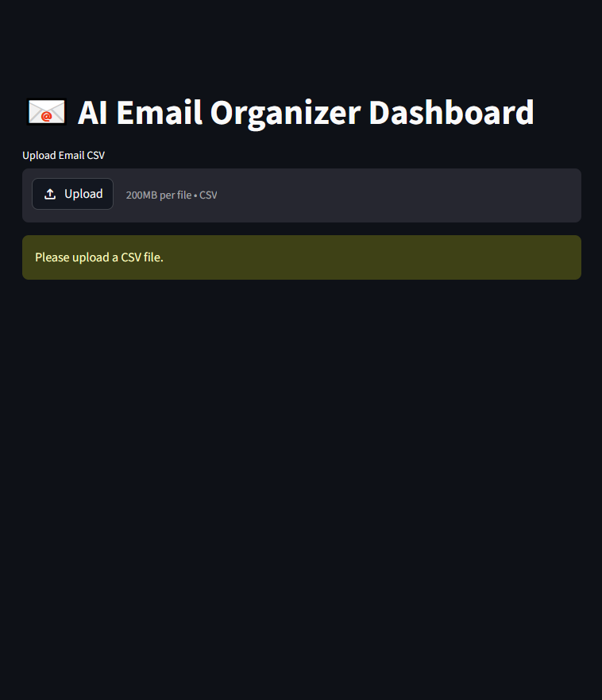
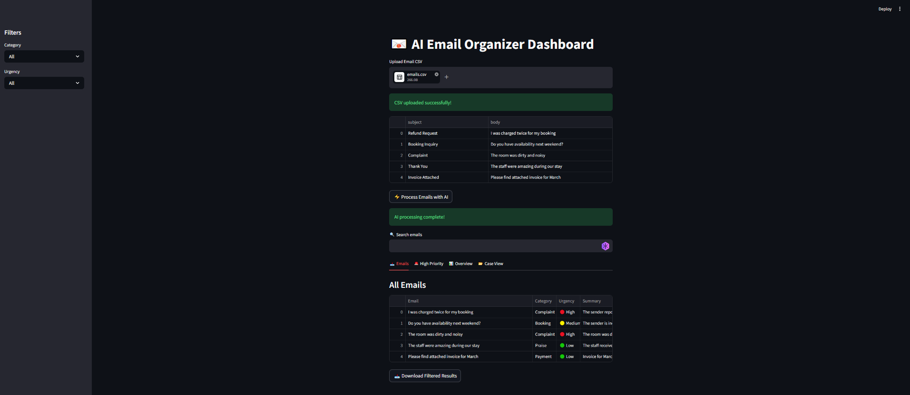
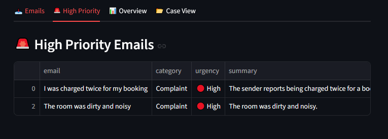
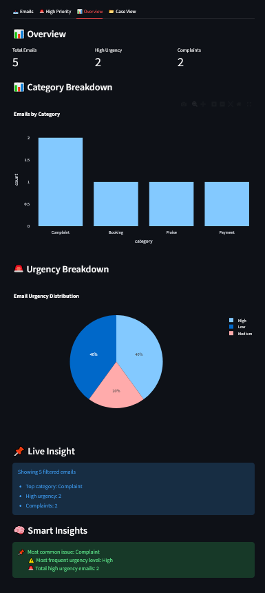
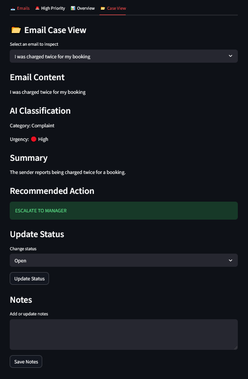

# 📧 AI Email Organizer Dashboard

An AI-powered email triage and case management dashboard built with Python, Streamlit, and the OpenAI API. Classifies, prioritises, and routes customer emails automatically — with a full interactive UI for managing responses.

---

## 🎯 What It Does

Customer support teams receive hundreds of emails daily. This tool automates the triage process:

1. **Upload** a CSV of emails
2. **AI classifies** each email by category and urgency using GPT-4o-mini
3. **Rule engine** assigns the correct action automatically
4. **Dashboard** lets agents review, filter, update, and export cases

---

## 🖥️ Demo Screenshots
>
> 
> 
> 
> 
> 

---

## ⚙️ Features

| Feature | Detail |
|---|---|
| AI Classification | Category + urgency + one-line summary per email |
| Rule-Based Routing | Auto-assigns action based on AI output |
| Filtering & Search | Filter by category, urgency, or free-text search |
| Case Management | Update status (Open / In Progress / Resolved) and add notes |
| Analytics | Bar and pie charts, KPI metrics, smart insights panel |
| Export | Download filtered results as CSV |

### Categories detected
`Complaint` · `Booking` · `Payment` · `Praise` · `Other`

### Urgency levels
`🔴 High` · `🟡 Medium` · `🟢 Low`

### Automated actions
- 🔴 High Complaint → **Escalate to Manager**
- 💰 High Payment issue → **Urgent Finance Review**
- 📅 Booking → **Send to Front Desk**
- ⭐ Praise → **No Action Required**
- Default → **Standard Processing**

---

## 🧱 Tech Stack

| Layer | Technology |
|---|---|
| Language | Python 3.10+ |
| Frontend | Streamlit |
| AI Model | OpenAI GPT-4o-mini |
| Data | Pandas |
| Charts | Plotly |
| Config | python-dotenv |

---

## 🚀 Getting Started

### 1. Clone the repo
```bash
git clone https://github.com/Dina-K/ai-email-organizer.git
cd ai-email-organizer
```

### 2. Install dependencies
```bash
pip install -r requirements.txt
```

### 3. Set up your API key
Create a `.env` file in the root directory:
```
OPENAI_API_KEY=your_openai_api_key_here
```

### 4. Run the app
```bash
streamlit run app.py
```

---

## 📁 CSV Format

Your input CSV must contain a column named `body` with the email text:

```csv
body
"Hello, I have been waiting 3 days for my refund and nobody has responded..."
"I'd like to book a table for 4 on Saturday evening please."
"Just wanted to say the service was absolutely wonderful, thank you!"
```

A sample file is included at `data/sample_emails.csv`.

---

## 📂 Project Structure

```
ai-email-organizer/
│
├── app.py                  # Main Streamlit application
├── requirements.txt        # Python dependencies
├── .env.example            # Environment variable template
├── .gitignore              # Excludes .env and cache files
├── README.md               # This file
│
└── data/
    └── sample_emails.csv   # Example input file for testing
```

---

## 💡 Key Learning Outcomes

- Integrating a live LLM API into a real application
- Building a rule-based automation layer on top of AI output
- Managing application state in Streamlit across user interactions
- Handling API errors and malformed responses gracefully
- Building a multi-tab interactive dashboard with filters, search, and export

---

## 🗺️ Potential Extensions

- [ ] Connect to Gmail or Outlook API for live email ingestion
- [ ] Add a database (SQLite or Supabase) to persist case history
- [ ] Auto-generate draft replies using AI
- [ ] Deploy to Streamlit Cloud for public access
- [ ] Add weekly summary email reports

---

## 👤 Author

**Edina Kovats**  
[GitHub](https://github.com/Dina-K)

---

## 📄 Licence

MIT — free to use and adapt.
